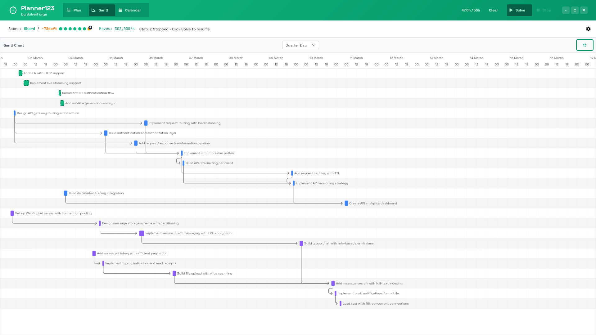
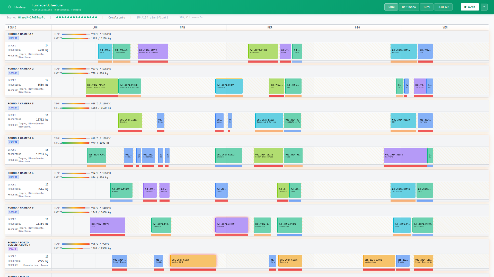

# solverforge-ui

Frontend component library for [SolverForge](https://solverforge.org)
constraint-optimization applications. Emerald-themed, zero-framework,
vendor-ready. One line to mount, zero npm in the runtime integration path,
zero webpack.

```rust
// Cargo.toml
solverforge-ui = { path = "../solverforge-ui" }

// main.rs
let app = api::router(state)
    .merge(solverforge_ui::routes())      // serves /sf/*
    .fallback_service(ServeDir::new("static"));
```

```html
<link rel="stylesheet" href="/sf/vendor/fontawesome/css/fontawesome.min.css">
<link rel="stylesheet" href="/sf/vendor/fontawesome/css/solid.min.css">
<link rel="stylesheet" href="/sf/sf.css">
<script src="/sf/sf.js"></script>
```

That's it. Every asset is compiled into the binary via `include_dir!`.

## Shipped vs Planned

This repository keeps both shipped UI code and design exploration in the same tree.

- Shipped features are the ones implemented in `js-src/`, or exposed as documented optional modules under `static/sf/modules/`, and described in the API reference below.
- Planned or exploratory ideas may appear in CSS or wireframes before the public API is finished. Those should not be treated as supported integration surface until they are wired into a shipped asset and described in the README API reference.
- When adding new surface area, update the JavaScript API, README, and runnable examples in the same change so the public contract stays explicit.

For production caching, versioned bundle filenames are also emitted as
`/sf/sf.<crate-version>.css` and `/sf/sf.<crate-version>.js`. Those versioned
files are served with immutable caching, while the stable `sf.css` and `sf.js`
paths remain available for compatibility.

## Screenshots

**Planner123** — Gantt chart with split panes, project-colored bars, and constraint scoring:



**Furnace Scheduler** — Timeline rail with resource cards, temperature/load gauges, and positioned job blocks:



## Philosophy

Every backend element has a corresponding UI element. The library grows
alongside the solver. When you scaffold a new SolverForge project with
`solverforge new`, it's already wired in.

## Testing

Repository coverage now includes the embedded Rust asset routes plus Node-based
frontend tests for backend adapters, focused solver lifecycle suites, and core
component rendering. Use `make test` for the full suite, `make test-quick` for
Rust doctests and unit tests plus frontend coverage, or `make test-frontend`
when you only want the JavaScript suite.

## Quick Start

```html
<body class="sf-app">
<script>
  var tabs = SF.createTabs({
    tabs: [
      { id: 'plan', content: '<div>Plan view</div>', active: true },
      { id: 'gantt', content: '<div>Gantt view</div>' },
    ],
  });
  document.body.appendChild(tabs.el);

  var backend = SF.createBackend({ type: 'axum' });

  var header = SF.createHeader({
    logo: '/sf/img/ouroboros.svg',
    title: 'My Scheduler',
    subtitle: 'by SolverForge',
    tabs: [
      { id: 'plan', label: 'Plan', icon: 'fa-list-check', active: true },
      { id: 'gantt', label: 'Gantt', icon: 'fa-chart-gantt' },
    ],
    onTabChange: function (id) { tabs.show(id); },
    actions: {
      onSolve: function () { solver.start(); },
      onPause: function () { solver.pause(); },
      onResume: function () { solver.resume(); },
      onCancel: function () { solver.cancel(); },
    },
  });
  document.body.prepend(header);

  var bar = SF.createStatusBar({ header: header, constraints: myConstraints });
  header.after(bar.el);

  var solver = SF.createSolver({
    backend: backend,
    statusBar: bar,
    onProgress: function (meta) {
      console.log('progress', meta.currentScore, meta.bestScore, meta.telemetry && meta.telemetry.movesPerSecond);
    },
    onSolution: function (snapshot) {
      render(snapshot.solution);
    },
    onPaused: function (snapshot, meta) {
      console.log('paused at snapshot', meta.snapshotRevision);
      render(snapshot.solution);
    },
    onComplete: function (snapshot, meta) {
      console.log('completed', meta.currentScore);
      render(snapshot.solution);
    },
  });
</script>
</body>
```

## API Reference

### Components

| Factory | Returns | Description |
|---------|---------|-------------|
| `SF.createHeader(config)` | `HTMLElement` | Sticky header with logo, title, nav tabs, and optional solve/pause/resume/cancel/analyze actions |
| `SF.createStatusBar(config)` | `{el, bindHeader, updateScore, setSolving, updateMoves, colorDotsFromAnalysis}` | Score display + constraint dot indicators; pass `header` or call `bindHeader()` if it should toggle local solve/stop controls |
| `SF.createButton(config)` | `HTMLButtonElement` | Button with variant/size/icon/shape modifiers |
| `SF.createModal(config)` | `{el, body, open, close, setBody}` | Dialog with emerald gradient header, backdrop, Escape key |
| `SF.createTable(config)` | `HTMLElement` | Data table with headers and row click |
| `SF.createTabs(config)` | `{el, show}` | Tab panel container with instance-scoped tab switching |
| `SF.createFooter(config)` | `HTMLElement` | Footer with links and version |
| `SF.createApiGuide(config)` | `HTMLElement` | REST API documentation panel |
| `SF.showToast(config)` | `void` | Toast notification (auto-dismiss) |
| `SF.showError(title, detail)` | `void` | Danger toast shorthand |
| `SF.showTab(tabId, root?)` | `void` | Activate matching tab panels in every tab container, or only within `root` when provided |

### Unsafe HTML APIs (opt-in)

Default content is always text-rendered. Use these fields only with trusted HTML:

| Factory | Unsafe HTML field |
|---------|-------------------|
| `SF.el(tag, attrs, ...)` | `unsafeHtml` |
| `SF.createModal(config)` | `unsafeBody` |
| `SF.createTabs(config)` | `tabs[].content.unsafeHtml` |
| `SF.createTable(config)` | `cells[].unsafeHtml` |
| `SF.gantt.create(config)` | `unsafePopupHtml`, `columns[].render(task).unsafeHtml` |

### Rail Scheduling

| Factory | Returns | Description |
|---------|---------|-------------|
| `SF.rail.createTimeline(config)` | `{el, setModel, setViewport, expandCluster, destroy}` | Canonical dense scheduling timeline with sticky time header, sticky lane labels, synchronized horizontal viewport, drag-to-pan, zoom presets, weekend shading, overlays, overview clustering, and packed detailed lanes |
| `SF.rail.createHeader(config)` | `HTMLElement` | Low-level day/period header primitive for furnace-style rail layouts |
| `SF.rail.createCard(config)` | `{el, rail, addBlock, clearBlocks, setSolving, setUnassigned}` | Low-level resource lane primitive with identity, gauges, stats, and block rail |
| `SF.rail.addBlock(rail, config)` | `HTMLElement` | Low-level positioned block (task/job) inside a primitive rail |
| `SF.rail.addChangeover(rail, config)` | `HTMLElement` | Low-level diagonal-striped gap between primitive blocks |
| `SF.rail.createHeatmap(config)` | `HTMLElement \| null` | Optional low-level heatmap strip aligned with a rail card |
| `SF.rail.createUnassignedRail(tasks, onTaskClick)` | `HTMLElement` | Optional low-level unassigned-pill row |

### Gantt (Frappe Gantt)

| Factory | Returns | Description |
|---------|---------|-------------|
| `SF.gantt.create(config)` | `{el, mount, setTasks, refresh, changeViewMode, highlightTask, destroy}` | Split-pane Gantt with grid table + Frappe Gantt chart |

### Solver Lifecycle

| Factory | Returns | Description |
|---------|---------|-------------|
| `SF.createBackend(config)` | Backend adapter | HTTP or Tauri IPC transport |
| `SF.createSolver(config)` | `{start, pause, resume, cancel, delete, getSnapshot, analyzeSnapshot, isRunning, getJobId, getLifecycleState, getSnapshotRevision}` | Shared job lifecycle orchestration around typed runtime events, exact paused snapshots, retained analysis, and terminal cleanup |

Startup streams may begin with either a scored `progress` event or a scored
`best_solution` event. Consumers must not require `progress` to arrive first.

Canonical stream payloads:

```json
{
  "eventType": "progress",
  "jobId": "job-42",
  "eventSequence": 1,
  "lifecycleState": "SOLVING",
  "currentScore": "0hard/-2soft",
  "bestScore": "0hard/-3soft",
  "telemetry": { "movesPerSecond": 12, "stepCount": 3200 }
}
```

```json
{
  "eventType": "paused",
  "jobId": "job-42",
  "eventSequence": 4,
  "lifecycleState": "PAUSED",
  "snapshotRevision": 2,
  "currentScore": "0hard/-1soft",
  "bestScore": "0hard/-1soft",
  "telemetry": { "movesPerSecond": 0, "stepCount": 6400 }
}
```

```json
{
  "eventType": "best_solution",
  "jobId": "job-42",
  "eventSequence": 2,
  "lifecycleState": "SOLVING",
  "snapshotRevision": 1,
  "currentScore": "0hard/-1soft",
  "bestScore": "0hard/-1soft",
  "telemetry": { "movesPerSecond": 15, "stepCount": 4200 },
  "solution": { "id": "job-42", "score": "0hard/-1soft" }
}
```

Runtime rules:
- The first lifecycle event for a newly started solve may be `progress` or `best_solution`, but it must already be scored.
- Backends that bootstrap startup state from a retained snapshot must not follow it with an identical startup `best_solution` duplicate.
- `progress` is metadata-only. It must not carry the solution payload.
- `best_solution` must include `solution` and `snapshotRevision`.
- `pause_requested` does not imply that a checkpoint is ready yet.
- `paused`, `completed`, `cancelled`, and `failed` are authoritative lifecycle events. `SF.createSolver()` syncs the retained snapshot before firing the corresponding callbacks.
- The status bar uses `currentScore` as the live score during solving.
- Missing or malformed typed lifecycle fields are ignored; they are not silently normalized into the contract.

### Utilities

| Function | Description |
|----------|-------------|
| `SF.score.parseHard(str)` | Extract hard score from `"0hard/-42soft"` |
| `SF.score.parseSoft(str)` | Extract soft score |
| `SF.score.parseMedium(str)` | Extract medium score |
| `SF.score.getComponents(str)` | `{hard, medium, soft}` |
| `SF.score.colorClass(str)` | `"score-green"` / `"score-yellow"` / `"score-red"` |
| `SF.colors.pick(key)` | Tango palette color for any key (cached) |
| `SF.colors.project(index)` | `{main, dark, light}` from 8-color project palette |
| `SF.colors.reset()` | Clear the color cache |
| `SF.escHtml(str)` | HTML-escape a string |
| `SF.el(tag, attrs, ...children)` | DOM element factory |

## Button Variants

```javascript
SF.createButton({ text: 'Solve',    variant: 'success' })   // white bg, emerald text
SF.createButton({ text: 'Stop',     variant: 'danger' })    // red bg, white text
SF.createButton({ text: 'Save',     variant: 'primary' })   // emerald-700 bg
SF.createButton({ text: 'Cancel',   variant: 'default' })   // gray border
SF.createButton({ icon: 'fa-gear',  variant: 'ghost', circle: true })
SF.createButton({ text: 'Settings', icon: 'fa-gear', variant: 'ghost', iconOnly: true })
SF.createButton({ text: 'Submit',   variant: 'primary', pill: true })
SF.createButton({ text: 'Delete',   variant: 'danger', outline: true })
SF.createButton({ text: 'Sm',       variant: 'primary', size: 'small' })
```

## Rail Scheduling

`SF.rail.createTimeline()` is the canonical read-only scheduling surface.
It accepts a normalized numeric model only; backend timestamp parsing and
timezone policy stay outside the library.

Model shape:

- `model.axis`: `startMinute`, `endMinute`, `days[]`, `ticks[]`, `initialViewport`
- `model.lanes[]`: `id`, `label`, optional `badges`, optional `stats`, optional `overlays`, `mode`, `items[]`
- `items[]`: `id`, `startMinute`, `endMinute`, `label`, optional `meta`, `tone`, optional `clusterId`, optional `detailItems[]`
- `overlays[]`: either numeric spans via `startMinute/endMinute` or full-day bands via `dayIndex/dayCount`

If you want stable programmatic expansion through `expandCluster(laneId, clusterId)`,
provide `clusterId` on the overlapping overview items that should expand together.
The example below assumes small consumer-side helpers such as `buildDays()` and
`buildSixHourTicks()` that normalize backend timestamps into numeric axis data.

```javascript
var timeline = SF.rail.createTimeline({
  label: 'Staffing lane',
  labelWidth: 280,
  model: {
    axis: {
      startMinute: 0,
      endMinute: 28 * 1440,
      days: buildDays(28),
      ticks: buildSixHourTicks(28),
      initialViewport: { startMinute: 0, endMinute: 14 * 1440 },
    },
    lanes: [
      {
        id: 'ward-east',
        label: 'By location · Ward East',
        mode: 'overview',
        badges: ['default'],
        overlays: [
          { dayIndex: 5, label: 'Unavailable', tone: 'red' },
          { dayIndex: 11, dayCount: 2, label: 'Desired', tone: 'emerald' },
        ],
        items: [
          { id: 'east-1', clusterId: 'east-rush', startMinute: 360, endMinute: 840, label: 'ER intake', meta: '8 clinicians', tone: 'blue' },
          { id: 'east-2', clusterId: 'east-rush', startMinute: 420, endMinute: 960, label: 'Trauma hold', meta: '6 clinicians', tone: 'blue' },
          { id: 'east-3', startMinute: 2 * 1440 + 360, endMinute: 2 * 1440 + 1080, label: 'Cardio block', meta: '5 clinicians', tone: 'emerald' },
        ],
      },
      {
        id: 'employee-ada',
        label: 'By employee · Ada',
        mode: 'detailed',
        badges: ['detailed'],
        items: [
          { id: 'ada-1', startMinute: 2 * 1440 + 360, endMinute: 2 * 1440 + 840, label: 'Primary shift', meta: 'Ward East', tone: 'amber' },
          { id: 'ada-2', startMinute: 2 * 1440 + 660, endMinute: 2 * 1440 + 1020, label: 'Handoff overlap', meta: 'Safety round', tone: 'amber' },
        ],
      },
    ],
  },
});
container.appendChild(timeline.el);

timeline.setViewport({ startMinute: 7 * 1440, endMinute: 21 * 1440 });
timeline.expandCluster('ward-east', 'east-rush');
```

Returned timeline API:

- `el`
- `setModel(model)`
- `setViewport(viewport)`
- `expandCluster(laneId, clusterId | null)`
- `destroy()`

### Low-Level Rail Primitives

Use these when you want to assemble a custom furnace-style resource rail
manually instead of using the higher-level scheduling timeline.

```javascript
var header = SF.rail.createHeader({
  label: 'Resource',
  labelWidth: 220,
  columns: ['Mon', 'Tue', 'Wed', 'Thu', 'Fri'],
});
container.appendChild(header);

var card = SF.rail.createCard({
  id: 'furnace-1',
  name: 'FORNO 1',
  labelWidth: 220,
  columns: 5,
  type: 'CAMERA',
  badges: ['TEMPRA'],
  gauges: [
    { label: 'Temp', pct: 85, style: 'heat', text: '850/1000°C' },
    { label: 'Load', pct: 60, style: 'load', text: '120/200 kg' },
  ],
  stats: [
    { label: 'Jobs', value: 12 },
    { label: 'Production', value: '840 kg' },
  ],
});
container.appendChild(card.el);

card.addBlock({
  start: 120,
  end: 360,
  horizon: 4800,
  label: 'ODL-2847',
  meta: 'Bianchi',
  color: 'rgba(59,130,246,0.6)',
  borderColor: '#3b82f6',
});

SF.rail.addChangeover(card.rail, { start: 360, end: 400, horizon: 4800 });
card.setUnassigned([{ id: 'late-queue', label: 'ODL-991' }]);
card.setSolving(true);
```

Gauge styles: `heat` (blue→amber→red), `load` (emerald→amber→red), `emerald` (solid green).
`badges` accepts either strings or `{ label, style }` objects for extra resource metadata.

## Gantt Chart

Interactive task scheduling with Frappe Gantt. Split-pane layout: task grid
on top, SVG timeline chart on bottom. Drag to reschedule, resize to change
duration, sortable grid columns, project-colored bars, dependency arrows,
and pinned task styling.

```html
<link rel="stylesheet" href="/sf/vendor/frappe-gantt/frappe-gantt.min.css">
<script src="/sf/vendor/frappe-gantt/frappe-gantt.min.js"></script>
<script src="/sf/vendor/split/split.min.js"></script>
```

```javascript
var gantt = SF.gantt.create({
  gridTitle: 'Tasks',
  chartTitle: 'Schedule',
  viewMode: 'Quarter Day',
  splitSizes: [40, 60],
  columns: [
    { key: 'name', label: 'Task', sortable: true },
    { key: 'start', label: 'Start', sortable: true },
    { key: 'end', label: 'End', sortable: true },
    { key: 'priority', label: 'P', render: function (t) {
      return {
        unsafeHtml: '<span class="sf-priority-badge priority-' + t.priority + '">P' + t.priority + '</span>',
      };
    }},
  ],
  onTaskClick: function (task) { console.log('clicked', task.id); },
  onDateChange: function (task, start, end) { console.log('moved', task.id, start, end); },
});

gantt.mount('my-container');

gantt.setTasks([
  {
    id: 'task-1',
    name: 'Design review',
    start: '2026-03-15 09:00',
    end: '2026-03-15 10:30',
    priority: 1,
    projectIndex: 0,
    pinned: true,
    custom_class: 'project-color-0 priority-1',
    dependencies: '',
  },
  {
    id: 'task-2',
    name: 'Implementation',
    start: '2026-03-15 10:30',
    end: '2026-03-15 14:00',
    priority: 2,
    custom_class: 'project-color-0 priority-2',
    dependencies: 'task-1',
  },
]);

gantt.changeViewMode('Day');
gantt.highlightTask('task-1');
```

View modes: `Quarter Day`, `Half Day`, `Day`, `Week`, `Month`.
Sortable headers are opt-in per column via `sortable: true`.

## Backend Adapters

### Axum (default)

```javascript
var backend = SF.createBackend({ type: 'axum', baseUrl: '' });
```

Expects standard SolverForge REST endpoints:
- `POST /jobs` — create a retained job
- `GET /jobs/{id}` — get job summary/status
- `GET /jobs/{id}/status` — get job status summary
- `GET /jobs/{id}/snapshot` — get the latest or requested retained snapshot
- `GET /jobs/{id}/analysis` — analyze the latest or requested retained snapshot
- `POST /jobs/{id}/pause` — request an exact runtime-managed pause
- `POST /jobs/{id}/resume` — resume from the retained checkpoint
- `POST /jobs/{id}/cancel` — cancel a live or paused job
- `DELETE /jobs/{id}` — delete a terminal retained job
- `GET /jobs/{id}/events` — SSE stream
- `GET /demo-data/{name}` — load demo dataset

Backend contract expectations:
- `createJob()` must resolve to a plain job id (string), or an object containing one of `id`, `jobId`, or `job_id`.
- `getSnapshot()` and `analyzeSnapshot()` accept an optional `snapshotRevision`. `SF.createSolver()` uses the exact revision from paused and terminal events when it syncs the retained state.
- `pauseJob()` requests a pause. `SF.createSolver().pause()` resolves only after the authoritative `paused` event and snapshot sync complete.
- `resumeJob()` resolves through the runtime event stream. `SF.createSolver().resume()` settles on the authoritative `resumed` event.
- `cancelJob()` settles through the runtime event stream. `SF.createSolver().cancel()` resolves when the terminal event has been synchronized.
- `deleteJob()` is destructive cleanup for terminal retained jobs only.
- Events passed into `streamJobEvents()` for a job should include one of the same identifiers if multiple solver runs are possible.
- Tauri payloads are ignored only when they carry a different job id than the active run; id-less single-run updates still pass through.
- Solver lifecycle events are canonical camelCase only: `eventType`, `jobId`, `eventSequence`, `lifecycleState`, `snapshotRevision`, `currentScore`, `bestScore`, `telemetry`, and `solution` where required.
- `eventType` must be explicit. Supported values are `progress`, `best_solution`, `pause_requested`, `paused`, `resumed`, `completed`, `cancelled`, and `failed`.
- Raw score-only progress payloads and implicit completion heuristics are not part of the supported stream contract.

### Tauri

```javascript
var backend = SF.createBackend({
  type: 'tauri',
  invoke: window.__TAURI__.core.invoke,
  listen: window.__TAURI__.event.listen,
  eventName: 'solver-update',
});
```

### Generic fetch (Rails, etc.)

```javascript
var backend = SF.createBackend({
  type: 'fetch',
  baseUrl: '/api/v1',
  headers: { 'X-CSRF-Token': csrfToken },
});
```

## Optional Modules

### Map (Leaflet)

```html
<link rel="stylesheet" href="/sf/vendor/leaflet/leaflet.css">
<script src="/sf/vendor/leaflet/leaflet.js"></script>
<link rel="stylesheet" href="/sf/modules/sf-map.css">
<script src="/sf/modules/sf-map.js"></script>
```

```javascript
var map = SF.map.create({ container: 'map', center: [45.07, 7.69], zoom: 13 });

map.addVehicleMarker({ lat: 45.07, lng: 7.69, color: '#10b981' });
map.addVisitMarker({ lat: 45.08, lng: 7.70, color: '#3b82f6', icon: 'fa-utensils' });
map.drawRoute({ points: [[45.07, 7.69], [45.08, 7.70]], color: '#10b981' });
map.drawEncodedRoute({ encoded: 'encodedPolylineString', color: '#3b82f6' });
map.fitBounds();
map.highlight('#10b981');   // dim all routes except this color
map.clearHighlight();

SF.map.decodePolyline('_p~iF~ps|U...');  // Google polyline algorithm
```

## Design System

### Colors

| Token | Hex | Usage |
|-------|-----|-------|
| `--sf-emerald-500` | `#10b981` | Primary brand, success states |
| `--sf-emerald-600` | `#059669` | Primary dark |
| `--sf-emerald-700` | `#047857` | Primary buttons, links |
| `--sf-red-600` | `#dc2626` | Danger buttons, hard violations |
| `--sf-amber-500` | `#f59e0b` | Warnings, soft violations |
| `--sf-gray-50` | `#f9fafb` | Backgrounds |
| `--sf-gray-900` | `#111827` | Primary text |

8 project colors for assignment: emerald, blue, purple, amber, pink, cyan, rose, lime.

### Fonts

- **Space Grotesk** (body, headings) — variable weight 300-700, self-hosted WOFF2
- **JetBrains Mono** (code, scores, data) — variable weight 100-800, self-hosted WOFF2

### Spacing

`--sf-space-{0,1,2,3,4,5,6,8,10,12,16}` — 0 to 4rem in quarter-rem increments.

### Shadows

`--sf-shadow-{sm,base,md,lg,xl,2xl}` — elevation scale.
`--sf-shadow-emerald` — colored shadow for branded elements.

### Animations

`sf-spin` / `sf-dot-pulse` / `sf-score-flash` / `sf-dialog-slide-in` / `sf-breathe` / `sf-slide-in` / `sf-fade-in` / `sf-late-glow`

## Project Structure

```
solverforge-ui/
├── Cargo.toml              # 2 deps: axum + include_dir
├── src/lib.rs              # routes() + asset serving
├── Makefile                # bundles css-src/ + js-src/ into sf.css + sf.js
├── .github/workflows/      # CI, release, and publish automation
├── css-src/                # 20 CSS source files (numbered for concat order)
│   ├── 00-tokens.css       #   design system variables
│   ├── 01-reset.css        #   box-sizing reset
│   ├── 02-typography.css   #   @font-face declarations
│   ├── 03-layout.css       #   .sf-app, .sf-main, tab panels
│   ├── 04-header.css       #   .sf-header
│   ├── 05-statusbar.css    #   .sf-statusbar + constraint dots
│   ├── 06-buttons.css      #   .sf-btn variants
│   ├── 07-modal.css        #   .sf-modal
│   ├── 08-table.css        #   .sf-table + constraint analysis table
│   ├── 09-badges.css       #   .sf-badge variants
│   ├── 10-cards.css        #   .sf-card, .sf-kpi-card
│   ├── 11-tooltip.css      #   .sf-tooltip
│   ├── 12-footer.css       #   .sf-footer
│   ├── 13-scrollbars.css   #   custom webkit scrollbars
│   ├── 14-animations.css   #   @keyframes + toast + api guide
│   ├── 15-rail-resources.css # resource cards, gauges, resource layout
│   ├── 16-rail-blocks.css  #   rail blocks, changeovers, unassigned styles
│   ├── 17-gantt-layout.css #   split layout, grid table, view controls
│   ├── 18-gantt-bars.css   #   Frappe bar overrides, pinned/highlighted bars
│   └── 19-rail-timeline.css #  canonical scheduling timeline
├── js-src/                 # 17 JS source files
│   ├── 00-core.js          #   SF namespace, escHtml, el()
│   ├── 01-score.js         #   score parsing
│   ├── 02-colors.js        #   Tango palette + project colors
│   ├── 03-buttons.js       #   createButton()
│   ├── 04-header.js        #   createHeader()
│   ├── 05-statusbar.js     #   createStatusBar()
│   ├── 06-modal.js         #   createModal()
│   ├── 07-tabs.js          #   createTabs(), showTab()
│   ├── 08-table.js         #   createTable()
│   ├── 09-toast.js         #   showToast(), showError()
│   ├── 10-backend.js       #   createBackend() — axum/tauri/fetch
│   ├── 11-solver.js        #   createSolver() — SSE state machine
│   ├── 12-api-guide.js     #   createApiGuide()
│   ├── 13-rail.js          #   low-level rail header, cards, blocks, changeovers
│   ├── 13a-rail-timeline.js #  canonical scheduling timeline
│   ├── 14-gantt.js         #   Frappe Gantt wrapper (split pane, grid, chart)
│   └── 15-footer.js        #   createFooter()
└── static/sf/              # Embedded assets (include_dir!)
    ├── sf.css              # concatenated from css-src/
    ├── sf.js               # concatenated from js-src/
    ├── img/                # SVG logo asset (ouroboros)
    ├── fonts/              # Space Grotesk + JetBrains Mono WOFF2
    ├── modules/            # optional: sf-map.js/css
    └── vendor/             # FontAwesome 6.5, Leaflet 1.9, Frappe Gantt, Split.js
```

## Integration Paths

| Project Type | How It Works |
|---|---|
| **Axum** | Add crate dep, call `.merge(solverforge_ui::routes())` |
| **Tauri** | Add crate dep, serve via Tauri's asset protocol or custom command |
| **Rails** | Copy `static/sf/` into `public/sf/`, reference in layouts |
| **Any HTTP server** | Copy `static/sf/`, serve as static files |
| **`solverforge new`** | Automatic — wired into generated project |

## Non-Rust Projects

The `static/sf/` directory is self-contained. Copy it, git-submodule it,
or symlink it into any project that serves static files:

```bash
# git submodule
git submodule add https://github.com/solverforge/solverforge-ui vendor/solverforge-ui
ln -s vendor/solverforge-ui/static/sf public/sf
```

## Development

```bash
# Edit source files
vim css-src/06-buttons.css
vim js-src/03-buttons.js

# Rebuild concatenated files
make

# Compile the crate (embeds updated assets)
cargo build
```

## Release Workflow

Consumer integration stays npm-free. Maintainer release automation does not.

- Current crate release: `0.4.3`.
- Keep `CHANGELOG.md` current as work lands.
- Use `RELEASE.md` as the source of truth when preparing a public release.
- Run `make pre-release` before tagging.
- Runtime and application integration use only the bundled static assets and the Rust crate.
- Version bump targets in `Makefile` currently use `npx commit-and-tag-version`.
- The GitHub and Forgejo release workflows trigger only after the generated `v*` tag is pushed.
- Release and publish validation otherwise run through Cargo and GitHub Actions.

If you are cutting a release locally, make sure Node.js with `npx` is available before using the `bump-*` targets. After the bump completes, push the release commit and tag with `git push --follow-tags` or an equivalent tag-push command so the release automation actually starts.

## Package Verification

Use `make package-verify` to inspect the exact crate contents that would be published.

The verification step checks that required bundled assets and crate metadata are present, and that development-only sources such as `css-src/`, `js-src/`, `scripts/`, and screenshots are not shipped in the published crate.

Bundling writes both stable compatibility assets (`static/sf/sf.css`,
`static/sf/sf.js`) and versioned assets (`static/sf/sf.<version>.css`,
`static/sf/sf.<version>.js`).

## Demo Fixtures

Runnable demo fixtures live in `demos/`.

- `demos/full-surface.html` exercises the primary shipped component surface together.
- `demos/timeline.html` is the focused dense scheduling example built with `SF.rail.createTimeline()`.
- `demos/rail.html` focuses on the low-level rail primitives: resource cards, blocks, gauges, and changeovers.
- `make demo-serve` serves the repository at `http://localhost:8000/demos/` for local validation.
- `make test-browser` runs browser-level smoke tests against the shipped demo fixtures.
- Run `make browser-setup` once on a machine to install the Playwright test dependency and Chromium.

## Acknowledgments

solverforge-ui builds on these excellent open-source projects:

| Project | Use | License | Link |
|---------|-----|---------|------|
| [Font Awesome Free](https://fontawesome.com) | Icons (Solid subset) | CC BY 4.0 (icons), SIL OFL (fonts), MIT (code) | [github](https://github.com/FortAwesome/Font-Awesome) |
| [Frappe Gantt](https://frappe.io/gantt) | Interactive Gantt chart | MIT | [github](https://github.com/frappe/gantt) |
| [Split.js](https://split.js.org) | Resizable split panes | MIT | [github](https://github.com/nathancahill/split) |
| [Leaflet](https://leafletjs.com) | Interactive maps (optional module) | BSD-2-Clause | [github](https://github.com/Leaflet/Leaflet) |
| [Space Grotesk](https://fonts.google.com/specimen/Space+Grotesk) | Body typeface | SIL Open Font License 1.1 | [github](https://github.com/floriankarsten/space-grotesk) |
| [JetBrains Mono](https://www.jetbrains.com/lp/mono/) | Monospace typeface | SIL Open Font License 1.1 | [github](https://github.com/JetBrains/JetBrainsMono) |
| [Axum](https://github.com/tokio-rs/axum) | Rust web framework | MIT | [github](https://github.com/tokio-rs/axum) |
| [include_dir](https://github.com/Michael-F-Bryan/include_dir) | Compile-time file embedding | MIT | [github](https://github.com/Michael-F-Bryan/include_dir) |

## License

Apache-2.0
